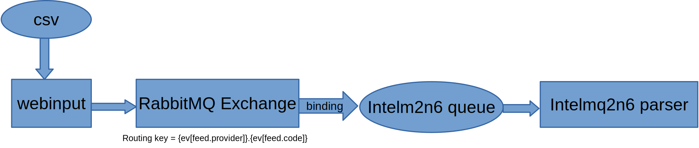

intelmq-webiput-csv can be used to feed data into n6 by pushing the data directly to the intelmq2n6 queue



# Configuration

First, setup the connection to the destination, including the correct *exchange*. For example:

```json
    "intelmq": {
        "destination_pipeline_broker": "amqp",
        "destination_pipeline_amqp_exchange": "integration",
        "destination_pipeline_host": "localhost",
        "destination_pipeline_username": "integration",
        "destination_pipeline_password": "integration",
        "destination_pipeline_port": 5671
    }
```

We also need to configure the routing key of the data to match "manual.<custom user input>". We can do that by formatting the destination queue, which corresponds to the routing key for exchanges and setting the first part to a fixed value while offering the second part to the user:

```json
    "destination_pipeline_queue": "{ev[feed.provider]}.{ev[feed.name]}",
    "destination_pipeline_queue_formatted": true,
    "constant_fields": {
        "feed.provider": "manual"
    },
    "custom_input_fields": {
        "feed.name": "whateveryouwant"
    }
```
